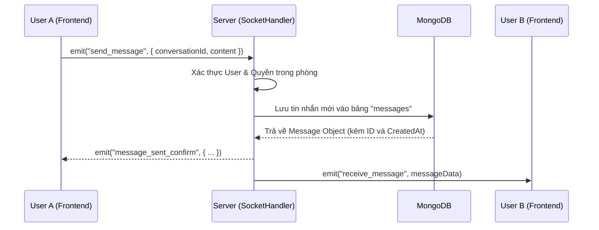

# Luồng WebSocket (WebSocket Flow)

BamboChat sử dụng **Socket.io** để xử lý giao tiếp thời gian thực giữa người dùng. Dưới đây là mô tả chi tiết cách hệ thống hoạt động.

---

## 1. Kết nối (Connection)

Khi User đăng nhập thành công vào Frontend:
1.  Frontend gọi hàm `connectSocket(token)`.
2.  Token được gửi kèm trong object `auth`.
3.  Server kiểm tra Token:
    *   Nếu hợp lệ: Chấp nhận kết nối và lưu `socket.id` tương ứng với `user_id`.
    *   Nếu không hợp lệ: Từ chối kết nối.

---

## 2. Luồng Gửi & Nhận tin nhắn

---

## 3. Các sự kiện chính (Main Events)

### Client gửi (Emits)
*   `send_message`: Gửi nội dung tin nhắn mới.
*   `typing`: Thông báo cho người khác biết mình đang nhập văn bản.
*   `join_conversation`: Tham gia vào một "Room" cụ thể để nhận thông báo riêng của phòng đó.

### Client nghe (Listens)
*   `receive_message`: Nhận tin nhắn mới từ người khác trong thời gian thực.
*   `user_online_status`: Nhận thông báo khi bạn bè online/offline.
*   `friend_request`: Nhận thông báo có lời mời kết bạn mới.

---

## 4. Tối ưu hóa

*   **Rooms**: Mỗi cuộc hội thoại (`conversation_id`) là một Room riêng biệt. Server chỉ broadcast tin nhắn cho các Socket đang ở trong Room đó.
*   **Offline Handling**: Nếu User không online, Server vẫn lưu tin nhắn vào DB. Khi User online trở lại, Frontend sẽ gọi API `/messages` để lấy lịch sử tin nhắn chưa đọc.
